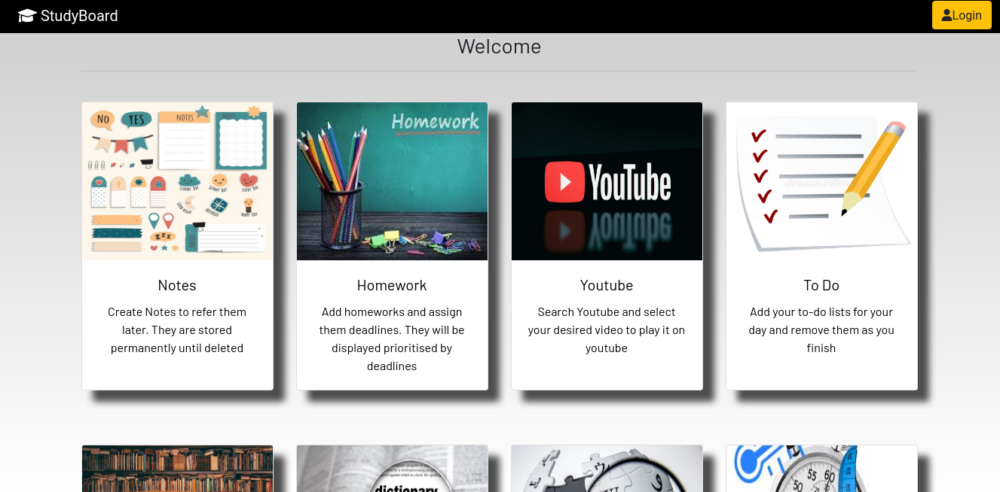

## Preview

<p align="center">

</p>

## Run Locally

### Cloning the repository

--> Clone the repository using the command below :
```shell
git clone https://github.com/dghuuloc/StudyBoard.git

```
--> Move into the directory where we have the project files : 
```shell
cd StudyBoard

```
--> Create a virtual environment :
```bash
# We should create our virtual environment
$ python -m venv venv

```
--> Activate the virtual environment :
```shell
$ source venv/bin/activate

```
--> Install the dependencies :
```shell
$ poetry install

```

### Setting up Database

``` shell
$ createdb -h localhost -p 5432 -U postgres studyboard
```
### Running the App

--> To run the App, we use :
```shell
python manage.py runserver

```
> ⚠ Then, the development server will be started at http://127.0.0.1:8000/


